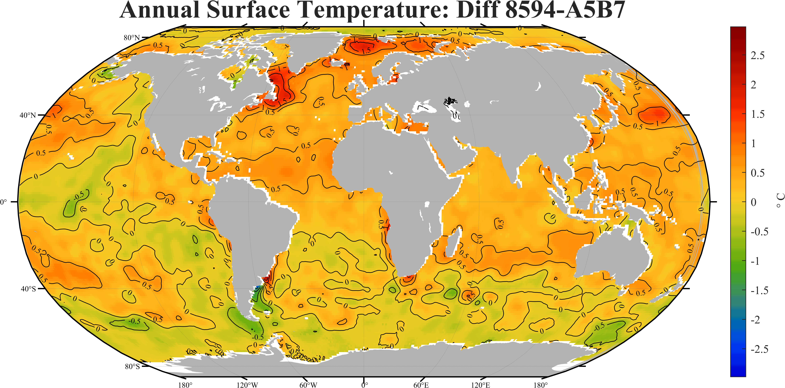
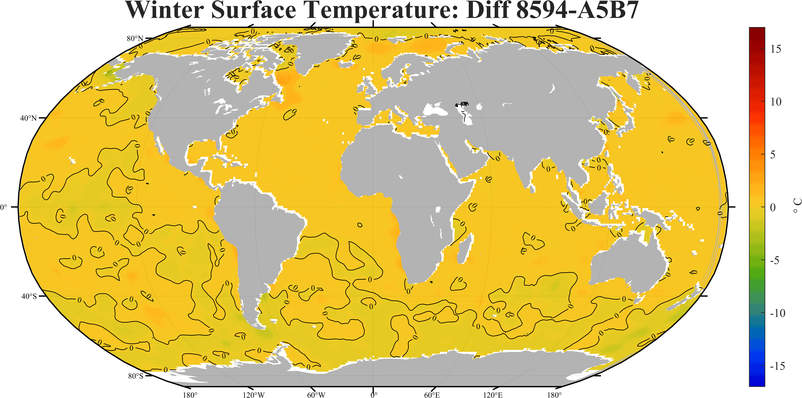
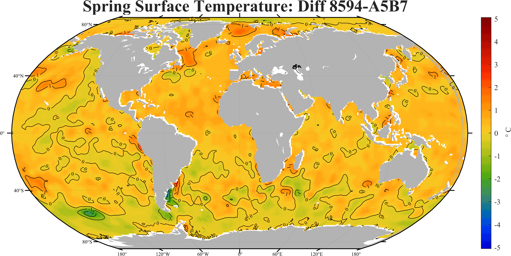
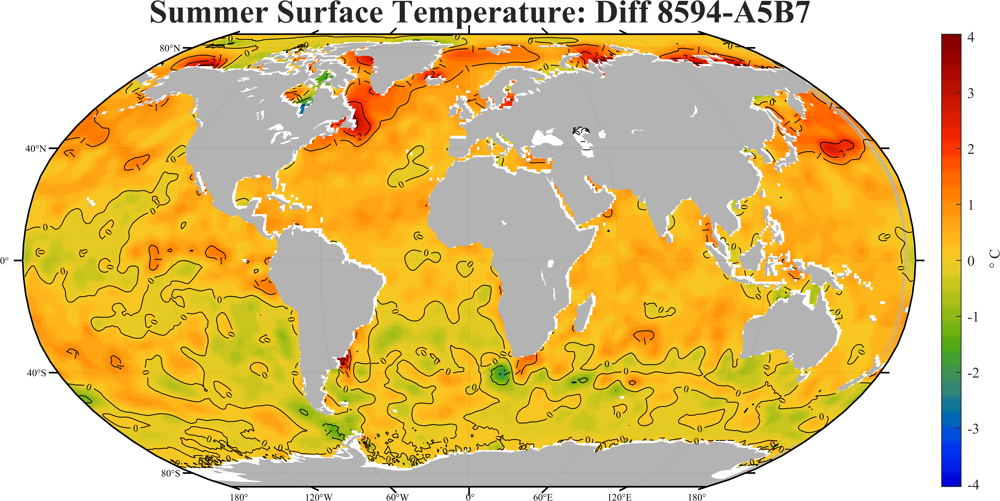
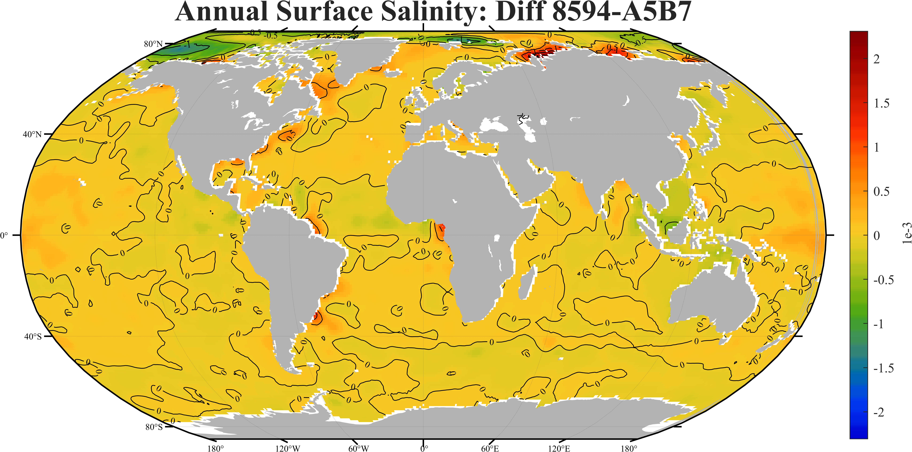
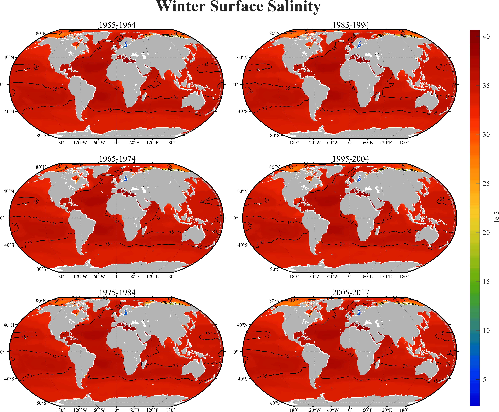
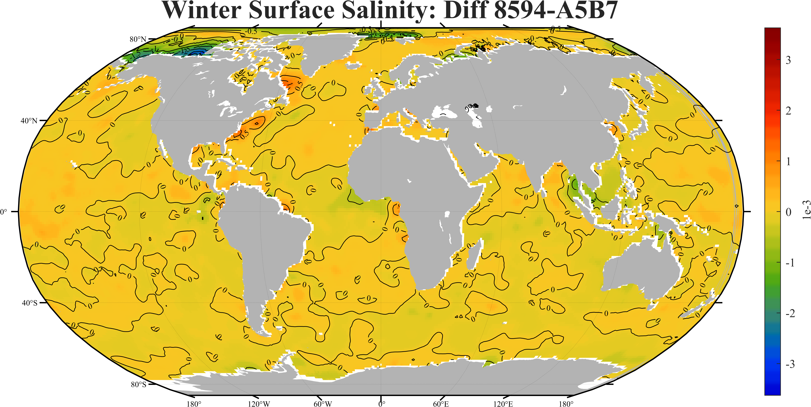
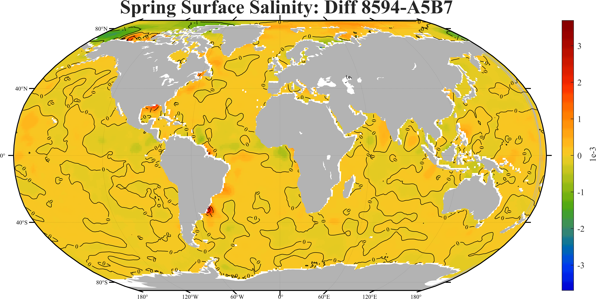
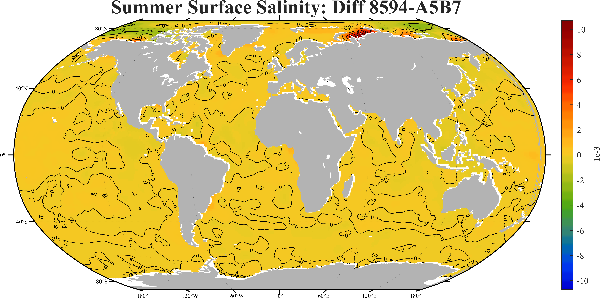
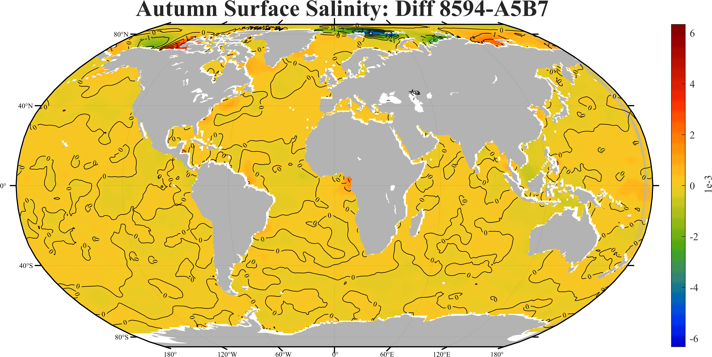

# SJTU_2021-2022-1-MS6401H

研-MS6401H-440-M01-物理海洋学

* [项目主页](https://grwei.github.io/SJTU_2021-2022-1-MS6401H/)
* [个人主页](https://grwei.github.io/)

## 摘要

1. 编写了从 [WOA18 数据集](https://www.ncei.noaa.gov/access/world-ocean-atlas-2018/)批量下载数据的脚本，可批量下载指定变量（例如，仅变量 `V_an`）的 `Netcdf` 子集。提供 `Command shell` 批处理版本 [`download_data.bat`](download_data.bat) 和 `Powershell` script 版本 [`download_data.ps1`](download_data.ps1)。

## 题目 1-1

### 描述

运用作图软件绘制以下各变量每个月的全球分布图，观察其分布随时间变化。分布图需类似第三章中全球蒸发，感热，潜热的图，包含颜色，等值线（线上标明该线代表的值），陆地与海洋的分界线（大陆边界线）等

1. 短波辐射，数据文件：[shortrad.cdf](data/shortrad.cdf)
2. 长波辐射，数据文件：[longrad.cdf](data/longrad.cdf)
3. 净热通量，数据文件：[netheat.cdf](data/netheat.cdf)
4. 降水量，数据文件：[precip.cdf](data/precip.cdf)
5. 蒸发量减降水量，数据文件：[emp.cdf](data/emp.cdf)

### 已知的问题

1. 统一颜色图范围后，受全局最值影响，颜色区分度下降，应如何改善？数据-颜色的映射默认是线性的，是否考虑改变？

### 提交

1. 短波辐射
   
2. 长波辐射
   
3. 净热通量
   
4. 降水量
   
5. 蒸发量减降水量
   

## 题目 1-2

### 已知的问题

1. 增量颜色图的 caxis：考虑用 prctile 函数，增量的绝对值的 75% 分位数。

### 描述

下载[WOA数据集](https://www.ncei.noaa.gov/access/world-ocean-atlas-2018/)中的温度，盐度数据（选择Objectively analyzed mean数据下载，如果选择netcdf格式，则变量都在一个文件里，直接下载找到Objectively analyzed mean变量即可），数据精度1°或1/4°，时间选择所有不同年代段（decade periods)的年平均(annual)与季节平均(seasonal)

1. 绘制各年代海表面温度与盐度的年平均与各季节平均图像，注意数值范围要统一（例如冬季温度颜色标尺如果使用-1度到30度范围，那么所有冬季温度都使用同样范围），比较表面温度与盐度空间上与时间上随各年代的变化
2. 绘制各年代的年平均与各季节的大西洋西经25°子午向断面图，太平洋西经170°子午向断面图。断面图需类似第二章温盐断面图，包含颜色，等值线等。注意数值范围统一，并比较断面温度与盐度空间上与时间上随各年代的变化

### 已知的问题

1. 如何批量下载 WOA18 数据？可能的解决方案：
   1. 查阅 WOA18 文档；
   2. 【**当前方案**】在 Windows 中，使用 `invoke-webrequest -uri <URL> -outfile <FILE>`(powershell ) 或 `curl <URL> -o <FILE>` (cmd)，可写成 cmd 批处理或 shell 脚本。参考[视频](https://www.bilibili.com/video/av972621898/)；
   3. 使用 `Python` 的有关库。

### 提交

1. 海表面
   1. 温度
      1. 年平均
         
         
      2. 冬季平均
         
         
      3. 春季平均
         
         
      4. 夏季平均
         
         
      5. 秋季平均
         
         
   2. 盐度
      1. 年平均
         
         
      2. 冬季平均
         
         
      3. 春季平均
         
         
      4. 夏季平均
         
         
      5. 秋季平均
         
         
2. 大西洋西经25°子午向断面
   1. 温度
      1. 年平均
      2. 冬季平均
      3. 春季平均
      4. 夏季平均
      5. 秋季平均
   2. 盐度
      1. 年平均
      2. 冬季平均
      3. 春季平均
      4. 夏季平均
      5. 秋季平均
3. 太平洋西经170°子午向断面
   1. 温度
      1. 年平均
      2. 冬季平均
      3. 春季平均
      4. 夏季平均
      5. 秋季平均
   2. 盐度
      1. 年平均
      2. 冬季平均
      3. 春季平均
      4. 夏季平均
      5. 秋季平均

## 联系我

Name: 危国锐（Wei Guorui）
ID: 120034910021
E-mail: 313017602@qq.com
