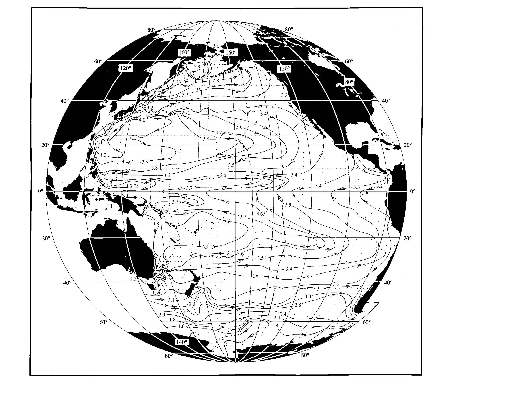
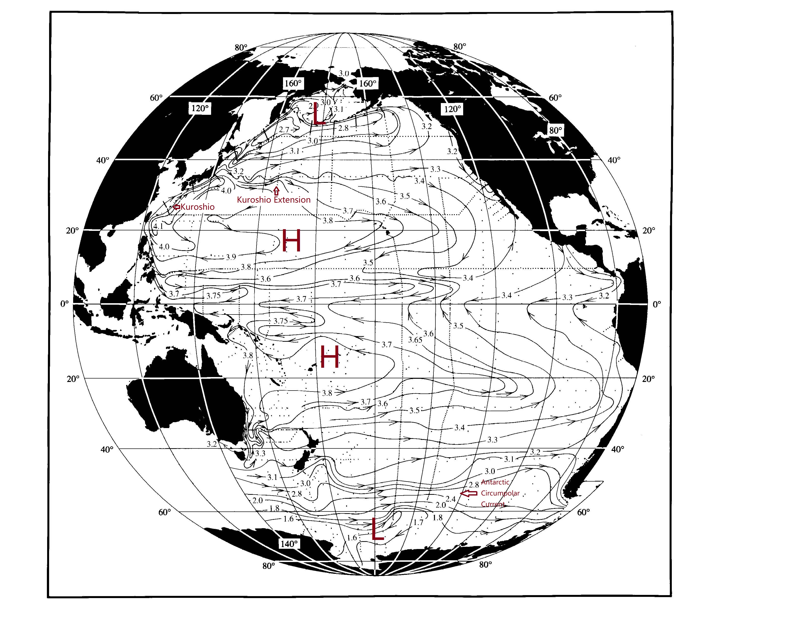

# 作业 3

研-MS6401H-440-M01-物理海洋学

* [课程主页](https://grwei.github.io/SJTU_2021-2022-1-MS6401H/)
* [个人主页](https://grwei.github.io/)

[toc]

## Question 1 (Geostrophy)

The attached figure shows surface height in the Pacific Ocean.

(a) Label the Kuroshio and Kuroshio Extension on the figure.

(b) Label the Antarctic Circumpolar Current.

(c) Label at least TWO high pressure regions, one in the northern hemisphere and one in the southern hemisphere.

(d) Label at least TWO low pressure regions, one in the northern hemisphere and one in the southern hemisphere.

**Answers of (a)~(d):**

图源：课程文档.

(e) Write down the geostrophic balance from the $x$ momentum equation. We will apply this to the northward Kuroshio. You may do this with a word equation or with the full momentum equation. Which terms in the full $x$ momentum equation are missing from the geostrophic balance?

**Answer:**

运动方程：
$$\begin{aligned}
    \tag{1}
    \dfrac{\mathop{\text{d} \boldsymbol{V}}}{\mathop{\text{d} t}} = -\dfrac{1}{\rho} \nabla p + \boldsymbol{g} + 2 \boldsymbol{V} \times \boldsymbol{\Omega} + \boldsymbol{F}_{\text{r}}.
\end{aligned}
$$

分解到水平面上：
$$\begin{aligned}
    \tag{2}
    \dfrac{\mathop{\text{d} \boldsymbol{V}_{\text{h}}}}{\mathop{\text{d} t}} = -\dfrac{1}{\rho} \nabla_{z} p + (fv - \tilde{f} w) \boldsymbol{i} - fu \boldsymbol{j} + F_{\text{r}x} \boldsymbol{i} + F_{\text{r}y} \boldsymbol{j}.
\end{aligned}
$$

量级分析：中纬度 $(f \approx \tilde{f})$ 大尺度运动通常是准水平 $(|w| \ll |u|,|v|)$、准定常 $(\dfrac{\partial}{\partial t} \equiv 0)$ 的，且惯性力（$u_j \dfrac{\partial u_i}{\partial u_j}$）和摩擦力 $\boldsymbol{F}_{\text{r}}$ 相对水平压强梯度力（PGF）和科氏力（COR）可略，水平运动方程 $(2)$ 成为地转平衡方程
$$\begin{aligned}
    \tag{3}
    -\dfrac{1}{\rho} \nabla_z p + \boldsymbol{V}_{\text{h}} \times f \boldsymbol{k} = \boldsymbol{0} \Rightarrow \boldsymbol{V}_{\text{h}} = \boldsymbol{V}_{\text{g}} := \dfrac{\boldsymbol{k}}{\rho f} \times \nabla p,
\end{aligned}
$$

或写成分量形式
$$\begin{aligned}
    \tag{3'}
    x: \quad & f v_{\text{g}} - \dfrac{1}{\rho} \dfrac{\partial p}{\partial x} = 0,\\
    y: \quad & -f u_{\text{g}} - \dfrac{1}{\rho} \dfrac{\partial p}{\partial y} = 0.
\end{aligned}
$$

与 $(2)$ 相比，地转平衡 $(3)$ 略去了局地加速度项、惯性力项（对流项）、$\tilde{f} w$ 项和摩擦力项.

(f) Understanding the non-dimensional Rossby number. Compare the size of the nonlinear advection terms with the Coriolis term to understand why we ignore the advection term. For the Kuroshio, assume a velocity (northward and eastward) scale of $1 \mathop{\text{m}/\text{sec}},$ and a width of $100 \mathop{\text{km}}.$ Use these scales as did for the Reynolds number to calculate first the magnitude of the advection and Coriolis terms, and then form a non-dimensional parameter that is the ratio of the scales of the advective to the Coriolis term. This will be the Rossby number. Under what conditions (large or small Rossby number) is a flow geostrophic? Does the Kuroshio fit this condition of geostrophic flow?

**Answer:**

量纲一的 Rossby 数
$$\begin{aligned}
    \tag{4}
    \mathrm{Ro} & := \dfrac{O(u_j \dfrac{\partial u_i}{\partial u_j})}{O(f \boldsymbol{V} \times \boldsymbol{k})}\\
    & = \dfrac{U^2 L^{-1}}{fU}\\
    & = \dfrac{U}{fL}.
\end{aligned}
$$

本题取特征水平速度 $U = 1 \mathop{\text{m} \cdot \text{s}^{-1}},$ 水平运动的特征尺度 $L = 10^{5} \mathop{\text{m}},$ Coriolis 参数 $f = 2 \Omega \sin{\varphi} \sim 10^{-4} \mathop{\text{s}^{-1}},$ 则 $\mathrm{Ro} = \dfrac{U}{fL} \sim \dfrac{1}{10^{-4} \times 10^{5}} = 0.1.$

在 (e) 的分析中已指出，准地转运动的平流项（惯性力）相对科氏力可略，即科氏力 $\gg$ 惯性力 $\Rightarrow \mathrm{Ro} \ll 1.$ 本题 Kuroshio 基本符合 $\mathrm{Ro} \ll 1.$

(g) From the map, assuming that the difference in height across the Kuroshio (low onshore to high offshore) is $0.7 \mathop{\text{m}}.$ Use this height difference, an average seawater density of $1025 \mathop{\text{kg} / \text{m}^3},$ and hydrostatic balance to calculate the pressure difference across the Kuroshio at an average depth of $10 \mathop{\text{m}}.$ From the pressure difference, use the geostrophic balance, and latitude $30 \mathop{{^\circ \text{N}}}$, to calculate the northward speed of the Kuroshio at $10 \mathop{\text{m}}.$

**Answer:**

静力平衡
$$\begin{aligned}
    \tag{5}
    \dfrac{\partial p}{\partial z} = - \rho g.
\end{aligned}
$$

上式对 $z$ 从位置 $z = -h$ 到海表面 $ z = \eta $ 积分，假定**海表面是自由面**（从而海表面压强是大气压 $p|_{z = \eta} = p_{\text{a}}$），得位置 $z = -h$ 处的压强
$$\begin{aligned}
    \tag{6}
    p = p_{\text{a}} + \rho g (h + \eta).
\end{aligned}
$$

进一步假定**海水密度为常数 $\overline{\rho}$**，则位置 $z = -h$ 处的压强差 $\delta p = \overline{\rho} g \delta \eta = 1025 \times 9.8 \times (+0.7) = 7031.5 \mathop{\text{Pa}}.$

由 $(3 {\text{'}})$ 得相应的地转流的 $y$ 分量
$$\begin{aligned}
    v_{\text{g}} & = \dfrac{1}{\overline{\rho} f} \dfrac{\partial p}{\partial x}\\
    & \approx \dfrac{1}{\overline{\rho} f} \dfrac{\delta p}{\delta x} = \dfrac{1}{\overline{\rho} f} \dfrac{\overline{\rho} g \delta \eta}{\delta x} = \dfrac{g}{2 \Omega \sin{\varphi}} \dfrac{\delta \eta}{\delta x}\\
    & = \dfrac{9.8}{2 \times (2 \pi / (24 \times 3600)) \times \sin{30 {^{\circ}}}} \dfrac{0.7 - 0}{100 \times 10^3 - 0}\\
    & = 0.943 \mathop{\text{m} \cdot \text{s}^{-1}}.
\end{aligned}
$$

(h) Assume now that the seawater density just east of the Kuroshio is $1024 \mathop{\text{kg} / \text{m}^3}$ and density just west of the Kuroshio is $1025 \mathop{\text{kg} / \text{m}^3}.$ Now do the same calculation as in part (g), but at a depth of $1000 \mathop{\text{m}}.$ What is the northward speed of the Kuroshio at $1000 \mathop{\text{m}}$ with this density difference across the current? Compare with the surface speed from part (g).

**Answer:**

由 $(3)(6)$ 得位置 $z = -h$ 处地转流的 $y$ 分量
$$\begin{aligned}
    \tag{7}
    v_{\text{g}} & = \dfrac{1}{\rho f} \dfrac{\partial \rho}{\partial x} g(h + \eta) + \dfrac{g}{f} \dfrac{\partial \eta}{\partial x}\\
    & \approx \dfrac{1}{((1024 + 1025) / 2) \times (7.27 \times 10^{-5})} \times \dfrac{1024 - 1025}{100 \times 10^{3} - 0}\\
    & \times 9.8 \times (1000 + ((0 + 0.7) / 2))\\
    & + \dfrac{9.8}{7.27 \times 10^{-5}} \times \dfrac{0.7 - 0}{100 \times 10^{3} - 0}\\
    & = -1.316 + 0.943\\
    & = -0.373 \mathop{\text{m} \cdot \text{s}^{-1}},
\end{aligned}
$$

可见这与 (g) 中的计算结果符号相反. 这是因为，在题给条件下，水平密度差异对地转流速的贡献与海表面高度差对地转流速的贡献异号：西侧密度较东侧大，由 $(5)$ 可知西侧压强随深度增加得较西侧快，利于压强西高东低；而东侧海表面较高，这一因素利于压强东高西低. 在接近海表面处，压强为东高西低；随着深度增加，两侧压强差先逐渐减小，至某一深度，压强差为零；深度继续增加，压强差逆转为西高东低，且压强差增大. 由 $(3)$ 可知，北半球的西侧高压将激发向南的地转流，故表层向北的地转流随深度增加将逆转向南的地转流.

## Question 2 (Thermal wind)

Assume the Kuroshio current speed is $2 \mathop{\text{m} / \text{s}}$ and the current width is $50 \mathop{\text{km}}.$ The current speed decreases with depth linearly and is $0$ at $1000 \mathop{\text{m}}.$ The Coriolis parameter is $8.6 \times 10^{-5} \mathop{\text{s}^{-1}}.$ Using thermal wind relation, calculate the temperature difference across the Kuroshio. Note: the equation of state can be expressed as $\rho=\rho_0 \left( 1 - 2 \times 10^{-4} \left( T - T_0 \right)\right),$ where $\rho_0$ is the density at the reference temperature $T_0,$ taken as $1000 \mathop{\text{kg} / \text{m}^3}.$

**Answer:**

记海表面处地转流为 $v_0 \boldsymbol{s}, v_0 = 2 \mathop{\text{m} / \text{s}}.$ 记 $\boldsymbol{s}$ 的左法向单位向量 $\boldsymbol{n} := \boldsymbol{k} \times \boldsymbol{s}.$ 由 $(3)$ 得
$$\begin{aligned}
    \tag{8}
    \dfrac{\partial \boldsymbol{V}_{\text{g}}}{\partial z} & = \dfrac{\boldsymbol{k}}{f} \times \dfrac{\partial}{\partial z} \left( \dfrac{1}{\rho} \nabla_z p \right)\\
    & = \dfrac{\boldsymbol{k}}{f} \times \left[ - \dfrac{1}{\rho^2} \dfrac{\partial \rho}{\partial z} \nabla_z p - \dfrac{g}{\rho} \nabla_z \rho \right]\\
    & \approx - \dfrac{\boldsymbol{k}}{f} \times \dfrac{g}{\rho} \nabla_z \rho.
\end{aligned}
$$

将状态方程
$$\begin{aligned}
    \tag{9}
    \rho = \rho_0 (a - b(T - T_0))
\end{aligned}
$$

代入 $(8),$ 得（这里已将 $(8)$ 视作等式）
$$\begin{aligned}
    \tag{10}
    \nabla_z T = - \dfrac{\rho f}{b \rho_0 g} \boldsymbol{k} \times \dfrac{\partial \boldsymbol{V}_{\text{g}}}{\partial z},
\end{aligned}
$$

式中 $a = 1, b = 2 \times 10^{-4}.$ 本题给定
$$\begin{aligned}
    \tag{11}
    \dfrac{\partial \boldsymbol{V}_{\text{g}}}{\partial z} = \dfrac{v_0 \boldsymbol{s} - \boldsymbol{0}}{0 - (-H)} = \dfrac{v_0}{H} \boldsymbol{s},
\end{aligned}
$$

式中 $H = 1000 \mathop{\text{m}}.$ 将 $(11)$ 代入 $(10),$ 得
$$\begin{aligned}
    \tag{12}
    \nabla_z T = - \dfrac{\rho f v_0}{b \rho_0 g H} \boldsymbol{n}.
\end{aligned}
$$

从而流动方向的右侧的温度比左侧的高
$$\begin{aligned}
    \tag{13}
    \delta T & \approx \dfrac{\partial T}{\partial n} \delta n\\
    & = (\boldsymbol{n} \cdot \nabla_z T)((-W) - 0)\\
    & = \dfrac{\rho f v_0 W}{b \rho_0 g H}\\
    & = \dfrac{1024 \times (8.6 \times 10^{-5}) \times 2 \times (5 \times 10^4)}{(2 \times 10^{-4}) \times 1000 \times 9.8 \times 1000}\\
    & = 4.49 \mathop{\text{K}}.
\end{aligned}
$$

## Question 3 (Reynolds number)

The momentum equation in the $x$-direction, ignoring variations in the $y$ and $z$ directions is:
$$\begin{aligned}
    \tag{14}
    \dfrac{\mathop{\text{d} u}}{\mathop{\text{d} t}} = \dfrac{\partial u}{\partial t} + u \dfrac{\partial u}{\partial x} = - \dfrac{1}{\rho} \dfrac{\partial p}{\partial x} + fv + \nu \dfrac{\partial^2 u}{\left. \partial x \right.^2}.
\end{aligned}
$$

We will compare the sizes of the advective and viscous terms.

(a) Assume that you can assign a scale $U$ to the $x$-velocity and $L$ to the $x$-length. These are scales that are intrinsic to the flow. That is, $L$ would be order (meters) for waves or order (thousands of kilometers) for large-scale circulation, etc. The scales are therefore basically just orders of magnitude. Write the order of magnitude of just the advection and viscous terms in terms of $U$ and $L.$ (Ignore the time dependent and pressure terms.)

**Answer:**

$$O(u \dfrac{\partial u}{\partial x}) \sim \dfrac{U^2}{L}, \quad O(\nu \dfrac{\partial^2 u}{\left. \partial x \right.^2}) \sim \dfrac{\nu U}{L^2}.$$

(b) What is the ratio of the sizes of the advection and viscous terms? This ratio will have no dimensions ("non-dimensional"). The ratio is called the **Reynolds number**.

**Answer:**

$$
\text{Re} := \left. O(u \dfrac{\partial u}{\partial x}) \right/ O(\nu \dfrac{\partial^2 u}{\left. \partial x \right.^2}) = \dfrac{UL}{\nu}.
$$

(c) Guess what does the Reynolds number measure or represent? If the Reynolds number is large, what is the relative importance of the advective and viscous terms in the equation of motion?

**Answer:**

雷诺数 $\text{Re}$ 表示惯性力（平流项）和粘性力的相对重要性. 当 $\text{Re} \gg 1$ 时，粘性力相对惯性力（平流项）可略.

(d) Estimate the Reynolds number of large-scale flows given the eddy viscosity is of the order of $10^2 \sim 10^3.$

**Answer:**

$$
\text{Re} = \dfrac{UL}{\nu} = \dfrac{0.2 \times (500 \times 10^3)}{10^2 \sim 10^3} = 10^3 \sim 10^2.
$$
